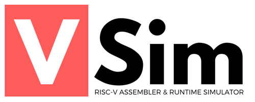
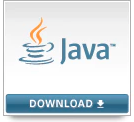

<p align="center">
  
  <br><br>
  <a href="https://github.com/andrescv/VSim/blob/master/LICENSE">
    
  </a>
  <a href="https://travis-ci.org/andrescv/VSim">
    
  </a>
  <a href="https://github.com/andrescv/VSim/releases">
    
  </a>
  
</p>

**VSim** is a RISC-V assembler and runtime simulator for educational purposes made in Java. Almost all the 32-bit base integer ISA can be simulated as well as the **M** and **F** extensions with all their respective pseudo-instructions. For a complete list of supported instructions please visit the [wiki](https://github.com/andrescv/VSim/wiki) page.

> We are currently in a beta version, but soon we will move to a stable version 1.0.0.

### Dependencies

**VSim** requires Java SE 8 (or later) JRE installed on your computer.

<p align="center">
  <a href="http://www.oracle.com/technetwork/java/javase/downloads/index.html">
  
  </a>
</p>

### Installation

To install or update **VSim**, you can use the install script (only on linux) with

**cURL**:

```shell
curl -o- https://raw.githubusercontent.com/andrescv/VSim/v1.0.0-beta/install.sh | bash
```
or **Wget**:

```shell
wget -qO- https://raw.githubusercontent.com/andrescv/VSim/v1.0.0-beta/install.sh | bash
```

You can also try it by downloading the following files: [VSim](#), and inside the unzipped folder enter the following command:

```shell
java -jar VSim.jar [flags] <files>
```

### Usage

For a detailed guide of the usage of the simulator please visit the [**wiki**](https://github.com/andrescv/VSim/wiki) page, where there is material on how you can start using the simulator as well as other support materials.

### Related projects

* [**Venus RV32IM Web Simulator**](http://www.kvakil.me/venus/), by Keyhan Vakil.

* [**MARS simulator**](http://courses.missouristate.edu/KenVollmar/mars/), by Pete Sanderson and Kenneth Vollmar.

### Contributing

Pull requests and stars are always welcome. For bugs and feature requests, [please create an issue](https://github.com/andrescv/VSim/issues/new).

### Acknowledgments

A big thank you to all the people working on the RISC-V project, for all the quality material that you develop (manuals, books, etc).
