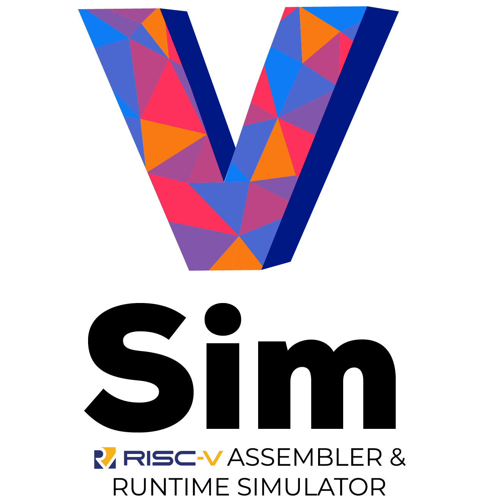

   
  
  
  
  
  
  

V-Sim is a simple assembler and runtime simulator inspired by _SPIM_ for programming in **RISC-V** assembly language and intended for educational purposes. One of the main goals was to make it functional and easy to use. Almost all the 32-bit base integer instruction set (`RV32I`) can be simulated, as well as the `M` and `F` extensions plus all the their respective pseudo-instructions. For the installation guide and a complete list of supported instructions, please visit the [docs](https://andrescv.github.io/V-Sim/) page.

### Contributing

Pull requests and stars are always welcome. For bugs and feature requests, [please create an issue](https://github.com/andrescv/VSim/issues/new).

### Acknowledgments

A big thank you to all the people working on the RISC-V project.
